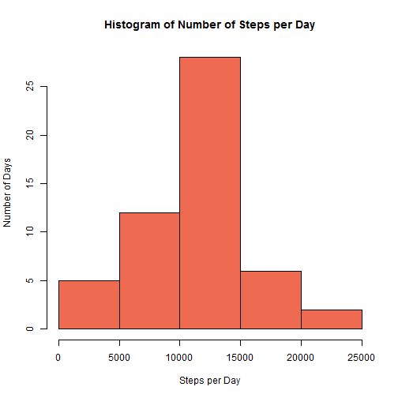
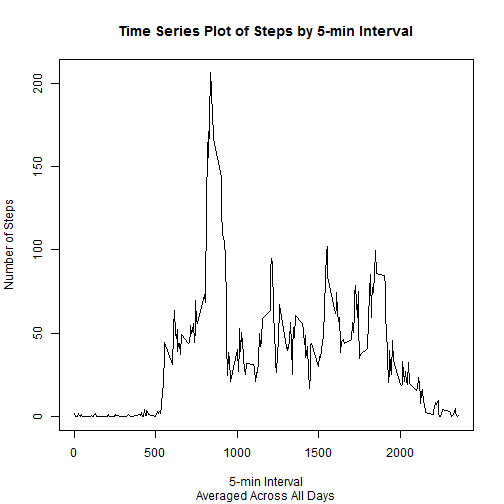
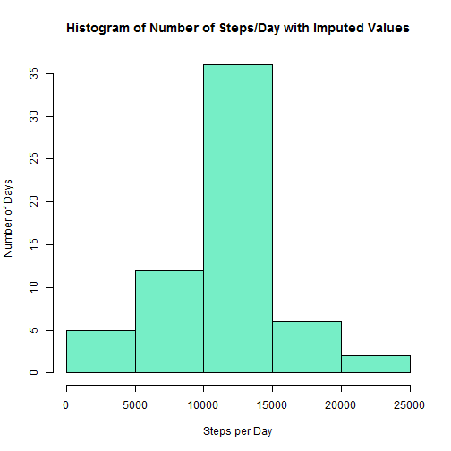
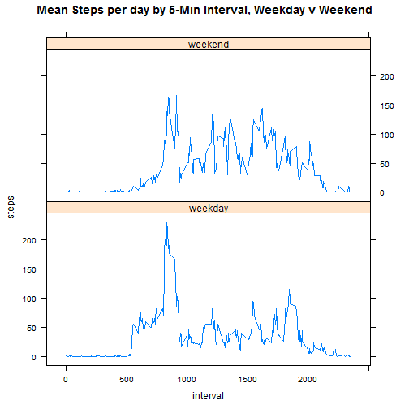

====================================
title: "R_script_1.Rmd"
author: "MB Moran"
date: "Saturday, October 18, 2014"

INTRODUCTION:  
=============
This is an R Markdown document for Coursera Course Reproduceable Research, Assignment 1. Markdown is a simple formatting syntax for authoring HTML, PDF, and MS Word documents. For more details on using R Markdown see <http://rmarkdown.rstudio.com>.

ASSIGNMENT OBJECTIVE:
====================
The purpose of this assignment is to (1) Create a reproducable research report using the R markdown tool available in RStudio, which must include all R code and figures/plots and (2) to place the markdown file (*.md) and html files which were created using the R "knitter" function in a public Github repository so that other students may complete a peer assessment review of the report.

DATA SOURCE:
============
This assignment makes use of data from a personal activity monitoring device. This device collects data at 5 minute intervals through out the day. The data consists of two months of data from an anonymous individual collected during the months of October and November, 2012 and include the number of steps taken in 5 minute intervals each day. The activity file is available at the below URL provided for the Coursera assignment.  It is also available on Roger Peng's Github repo, along with a Readme file containing the assignment objectives 

Data source URL: https://d396qusza40orc.cloudfront.net/repdata%2Fdata%2Factivity.zip
Github Repo URL (project): (Roger Peng): http://github.com/rdpeng/RepData_PeerAssessment1
Gihub Repo URL (forked to mbmoran): https://github.com/mbmoran/RepData_PeerAssessment1

ANALYSIS OBJECTIVES:
===================
The analysis explores the activity data. Following getting and cleaning of the data, the analysis answers specific questions in the assignment about the number of steps taken: per 5 minute interval, per day and per type of day - ie whether or not there are any differences on the weekend vs on weekdays, using the data derived from the activity monitoing device.

R CODE CHUNK STEPS:
==================

## Step 1:  Set the working directory and install required packages.


```r
# Step 1 -  Set working directory
# The instructor suggested to set the working directory outside of this markdown script, using R console. It is displayed here as a comment
setwd("~/Actuarial/Coursera/Data Science/Reproducable Research/Assignments/Assignment 1")

# Load packages needed for this script. Uncomment when running script the first time
install.packages("rmarkdown")
```

```
## Installing package into 'C:/Users/Mary/Documents/R/win-library/3.1'
## (as 'lib' is unspecified)
```

```
## package 'rmarkdown' successfully unpacked and MD5 sums checked
## 
## The downloaded binary packages are in
## 	C:\Users\Mary\AppData\Local\Temp\RtmpkhXbt7\downloaded_packages
```

```r
install.packages("knitr")
```

```
## Error in install.packages : Updating loaded packages
```

```r
library(lattice)
library(knitr)
```

## Step 2:  Loading and preprocessing the data


```r
# STEP 2 - After downloading and unzipping the zip file from the data source URL into the working directory, read the activity data file, create a data frame and only retain complete cases in df2
activity<-read.csv("activity.csv")
activity_df<-data.frame(activity)
activity_df2<-activity_df[complete.cases(activity_df),]
activity_df2$date<-droplevels(activity_df2$date)
rownames(activity_df2)<-NULL

activity_byday<-aggregate(steps~date, FUN=sum, data=activity_df2)
```

## Step 3: What is mean total number of steps taken per day? Make a histogram and report mean and median


```r
# STEP 3 - Create Histogram of activity. Ignore missing values by using df2 created in step 2
hist(activity_byday$steps,main="Histogram of Number of Steps per Day",col="coral2",xlab="Steps per Day",ylab="Number of Days")
```

 

```r
stepsperday.mean<-mean(activity_byday$steps,na.rm=TRUE)
stepsperday.median<-median(activity_byday$steps,na.rm=TRUE)
cat('The mean steps taken per day is: ',stepsperday.mean)
```

```
## The mean steps taken per day is:  10766.19
```

```r
cat('The median steps taken per day is: ',stepsperday.median)
```

```
## The median steps taken per day is:  10765
```

## Step 4: What is the average daily activity pattern? 
    4A: Make a time series plot by 5-min interval
    4B: Which 5-min interval has the maximum number of steps, averaged across all days?  


```r
# STEP 4 - Make time series plot by 5-min interval

activity_byinterval<-aggregate(steps~interval, FUN=mean, data=activity_df2)

plot(x=activity_byinterval$interval,y=activity_byinterval$steps,type="l",main="Time Series Plot of Steps by 5-min Interval",sub="Averaged Across All Days",xlab="5-min Interval",ylab="Number of Steps")
```

 

```r
stepsperday.max.interval<-max(activity_byinterval$steps,na.rm=TRUE)
whichinterval<-activity_byinterval$interval[which(activity_byinterval$steps==stepsperday.max.interval)]
cat('The 5-min interval which has the max number of steps, averaged over all days is: ',whichinterval)
```

```
## The 5-min interval which has the max number of steps, averaged over all days is:  835
```

```r
cat('The time of day for this 5 min interval is (24hr basis): ',trunc(whichinterval/60),':',(whichinterval/60-trunc(whichinterval/60))*60)
```

```
## The time of day for this 5 min interval is (24hr basis):  13 : 55
```

## Step 5: After imputing values for missing data (NAs) What is mean total number of steps taken per day? Make a histogram and report mean and median and compare this to step 3 when NAs were ignored


```r
# STEP 5 - Create Histogram of activity. Impute missing values by using the average steps by interval
activity_df3<-merge(x=activity_df,y=activity_byinterval,by.x="interval",by.y="interval")
activity_df3$steps<-ifelse(is.na(activity_df3$steps.x),activity_df3$steps.y,activity_df3$steps.x)
numberofNA<-sum(is.na(activity_df3$steps.x))

activity_byday2<-aggregate(steps~date, FUN=sum, data=activity_df3)
    
hist(activity_byday2$steps,main="Histogram of Number of Steps/Day with Imputed Values",col="aquamarine2",xlab="Steps per Day",ylab="Number of Days")
```

 

```r
stepsperday.imputed.mean<-mean(activity_byday2$steps,na.rm=TRUE)
stepsperday.imputed.median<-median(activity_byday2$steps,na.rm=TRUE)
cat('The number of rows with missing=NA data for one or more fields is: ',numberofNA)
```

```
## The number of rows with missing=NA data for one or more fields is:  2304
```

```r
cat('The mean steps taken per day is: ',stepsperday.imputed.mean)
```

```
## The mean steps taken per day is:  10766.19
```

```r
cat('The median steps taken per day is: ',stepsperday.imputed.median)
```

```
## The median steps taken per day is:  10766.19
```

Analysis of Step 5:  The effect of imputing missing values on the total number of steps per day, (using mean interval steps as the basis) compared to ignoring missing values (i.e., excluding those rows with NAs from the dataset) is very minor. The mean steps per day in both cases was identical = 10,766.  Since there were only 8 days out of 61 with NA values, imputing these 8 days to be equal to the mean made little difference in the aggregate vs dropping the 8 days.  One advantage of imputing values is to be able to display a data point for every day of the study. A disadvantage, is that the imputed value can bias aggregate statistics.

## Step 6: Are there differences in activity patterns between weekdays and weekends?
     6A: Create factor variable indicating whether the date falls on a weekday or weekend
     6B: Create a panel plot - time series of the 5-min interval (xaxis) and avg steps/day (yaxis)
    

```r
# STEP 6 - Create factor variable daytype and panel plot split by weekend and weekday type
activity_df3$datefmt<-as.Date(activity_df3$date,format="%Y-%m-%d")
activity_df3$daynumber<-setNames(1:7, c("Monday", "Tuesday", "Wednesday", "Thursday", "Friday", "Saturday","Sunday"))[weekdays(as.Date(activity_df3$datefmt))]
activity_df3$daytype<-ifelse(activity_df3$daynumber>5,"weekend","weekday")

activity_byinterval2<-aggregate(steps~interval+daytype,FUN=mean,data=activity_df3)
activity_byinterval2$steps<-trunc(as.numeric(activity_byinterval2$steps))
activity_byinterval2<-transform(activity_byinterval2,daytype=factor(daytype))

# Plot using Lattice, mean steps per interval weekend vs weekday
xyplot(steps~interval|daytype,data=activity_byinterval2,layout=c(1,2),type="l", main='Mean Steps per day by 5-Min Interval, Weekday v Weekend')
```

 
